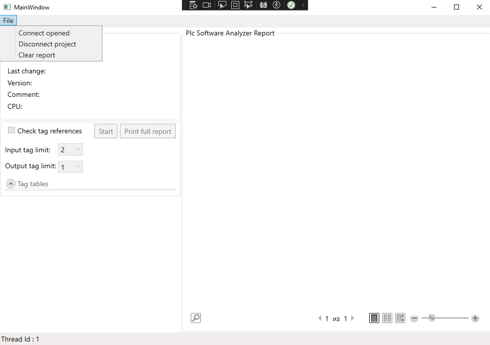
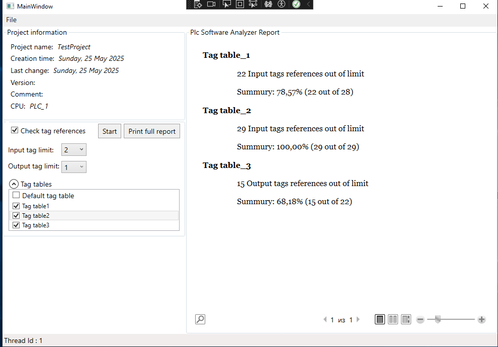

# PLC Tag Reference Analyzer

## Overview

**PLC Tag Reference Analyzer** is a WPF desktop application that leverages **TIA Portal Openness API** to analyze the number of references to PLC tags in a Siemens TIA Portal project. The tool helps engineers and developers to understand how tags are used throughout a project, supporting better organization, optimization, and maintenance of automation systems.

---

## Features

- Integration with Siemens TIA Portal through Openness API
- Automatic parsing of PLC tags from the project
- Calculation of the number of references for each tag
- Export of analysis results to Excel
- Designed for large-scale industrial automation projects

---

## Requirements

- **Operating System:** Windows 10 or 11
- **Development Environment:** Visual Studio 2019 or later
- **TIA Portal Version:** Compatible with TIA Portal v19.0 and later *(update with your version)*
- **TIA Openness:** Must be installed and licensed
- **.NET Runtime:** .NET Framework 4.7.2 or late
- **Admin Rights:** Required for launching TIA Openness programmatically

---

## Installation by Visual Studio

1. Clone this repository:
   ```bash
   git clone https://github.com/your-username/plc-tag-reference-analyzer.git
   ```
2. Open the solution in Visual Studio.

3. Restore NuGet packages (if any).

4. Make sure TIA Openness libraries are correctly referenced:

5. Add COM or .NET wrapper references manually if necessary.

6. Ensure TIA Portal is installed on your system.

7. Build and run the application.

---

## Installation by setup file.

1. Download installation file [PlcSoftAnalyzerInstaller.exe](https://github.com/DmitryKarpuk/PlcSoftAnalyzer/releases/download/v1.0.0/PlcSoftAnalyzerInstaller.exe) 
2. Run the installer as Administrator

---

## Usage

1. Launch the application.

2. Connect to an open instance of TIA Portal. For now application establish connection only to the localy opened project.

3. Select checkbox "Check tag references"

4. Select PLC tag tables for analyzing.

5. Set up references thresholds for HW output and HW input tags.
    Tags posesed 0 references or greater then thresholds will be included into the report.

6. Click "Start" pushbutton 

7. Optionally, export results to .xlsx for reporting or further processing.

---

## User interface
1. Main menu

2. Generated report.


---

## Known Limitations
- Application works only with local opened project. Handling server projects will be enabled in future versions.

- TIA Openness requires a valid license and proper setup in your environment.

- Only works with supported versions of TIA Portal and Windows.